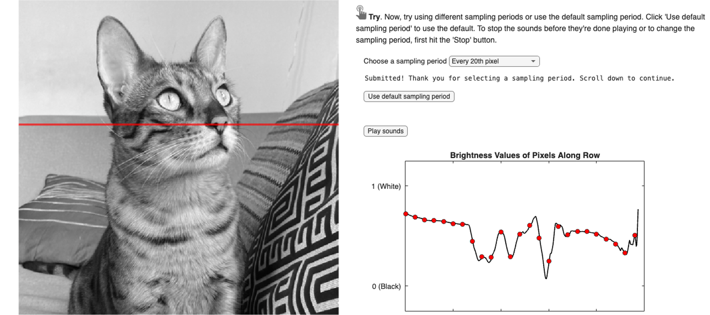

# Bright Beats Challenge - MATLAB Simulation

This repository includes the student activity files and instructor guide for the MATLAB® activity accompanying the [TryEngineering Bright Beats Challenge](https://tryengineering.org/resource/lesson-plan/bright-beats-challenge/).

In this activity, you'll be turning brightness values extracted from a digital image into piano sounds! Earlier, as part of the TryEngineering Bright Beast Design Challenge, you used a micro:bit to create a digital synthesizer that could transform ambient light levels and simple images into musical notes. The device you built empowered users to "hear" light as sounds, a tool that could be especially useful for those who are visually impaired. In this MATLAB activity, you will turn pixels from digital images into piano notes. In the process, you'll uncover the power of computers and programs like MATLAB for transforming visual and audio signals through signal processing and learn how images are represented by computers. Building upon the micro:bit activity with the power of MATLAB, you'll be able to customize the sounds further and translate more complex images into sounds.

## Set-up
**Required MathWorks® Products (https://www.mathworks.com)**

This was created with MATLAB release R2025b
- [MATLAB](https://www.mathworks.com/products/matlab.html)

**Other Materials**
- micro:bit device built as part of the Bright Beats Design Challenge
- Blank paper, black markers or pens, and colored markers or pens
- _Optional_: webcam to take a picture or personal pictures uploaded to device. If using a webcam, note that the 'MATLAB Support Package for USB Webcams' must be installed via the Add-Ons Explorer.

## Instructions

1. Complete the TryEngineering Bright Beats Design Challenge. 
2. Open this repository in MATLAB Online, or clone and download this repository to your local machine and open in MATLAB.
3. Open the "BrightBeatsChallenge_Student.mlx" Live Script to follow the step by step instructions.

## License

The license is available in the License.txt file in this GitHub repository.

## Community Support

[MATLAB Central](https://www.mathworks.com/matlabcentral/)

Copyright 2025 The MathWorks, Inc.
